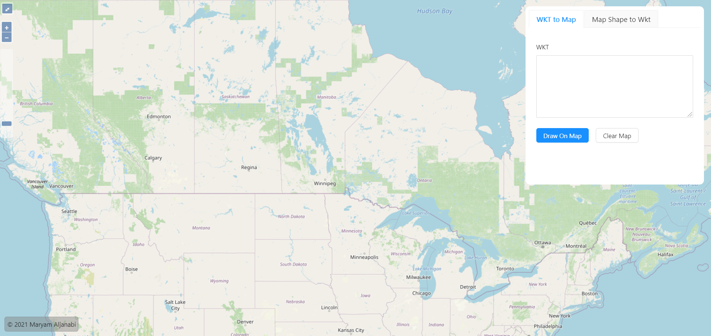

# React Openlayers Shapes Tool

## Table of contents

- [Introduction](#introduction)
- [Demo](#demo)
- [Features](#features)
- [Technology](#technology)
- [Run](#run)
- [License](#license)

## Introduction

An application that allows users to draw WKT on map or draw a shape on map and get its WKT.

WKT stands for Well-Known Text, which is a form of representing vector geometry. You can read more about WKT and its types here [WKT Wikipedia](https://en.wikipedia.org/wiki/Well-known_text_representation_of_geometry)

## Demo

This application is deployed on Github Pages and can be accessed through the following link:

[React Openlayers Shapes Tool](http://maryamaljanabi.github.io/react-openlayers-shapes-tool)

## Technology

The main technologies used to build this application are:

- Node.js version 14.16.0
- React.js version 17.0.2
- Antd, a React UI Framework, version 4.16.3
- Openlayers, a JavaScript library for displaying map data in web browsers as slippy maps, version 6.5.0
- React-Geo, A set of geo related modules, used to achieve drawing shapes on map, version 14.2.4

## Features

This app serves as a tool to draw WKT on a map. The accepted WKT formats are:

- POINT
- LINESTRING
- POLYGON
- MULTIPOINT
- MULTILINESTRING
- MULTIPOLYGON
- GEOMETRYCOLLECTION

When trying to draw any other format on map, an error is shown. Please mind the capitalization when drawing these WKT shapes, for example, when drawing a point, please write it as either "POINT" or "Point" and be sure not to use smallcase "point".

The second feature is that the user can draw shapes on the map and get their WKT string. The supported shapes are:

- Line
- Rectangle
- Polygon
- Circle

## Run

Just use "npm install" in the root directory and run the app through "npm start" and the app should be ready.

## License

- MIT License
- Copyright 2021 © [Maryam Aljanabi](https://github.com/maryamaljanabi)
